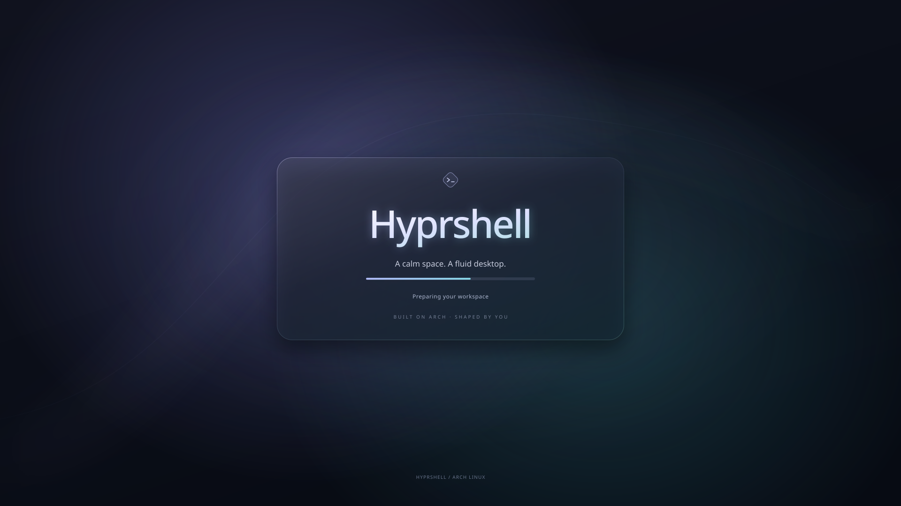
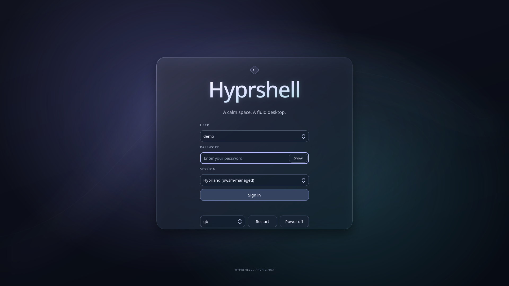

# Hyprshell

Hyprshell is a configurable desktop shell for **Hyprland on Arch Linux**, built
with **Quickshell**. It brings the application launcher, status bar, desktop
menus, notification inbox, and settings into one native Wayland interface.

**hyprbar** is the name of Hyprshell's top bar. References to the “bar”,
“top bar”, or “topbar” in this documentation mean hyprbar.

The goal is a consistent desktop experience from boot and login through daily
use, with a lightweight foundation that gives beauty and performance equal
priority. Hyprshell builds on Hyprland and native Qt 6 components, brings
desktop controls into a shared shell, and keeps additional applications
optional. Development should favor efficient rendering, responsive controls,
and minimal background work as the desktop grows.

The bar uses translucent glass surfaces that adapt to the wallpaper beneath
each item. Its layout and appearance can be changed through a graphical
settings window, including the position of modules and selected Hyprland
appearance options.

This repository includes the shell, a Hyprland configuration, an Arch Linux
installer, desktop utilities, and wallpapers. Together they provide a common
desktop setup that users can install and customize through the same workflow.
It installs onto an existing Arch system; it does not install the operating
system, partition disks, install a bootloader, or install GPU drivers. It can
configure the animated Hyprshell Glass splash for a supported existing boot setup.
Full setup also installs the matching animated SDDM login theme and restores
the desktop preferences saved in this checkout.

## Contents

- [Features](#features)
- [Requirements](#requirements)
- [Installation](#installation)
- [A consistent desktop experience](#a-consistent-desktop-experience)
- [First login and machine-specific configuration](#first-login-and-machine-specific-configuration)
- [Using the desktop](#using-the-desktop)
- [Keyboard and mouse shortcuts](#keyboard-and-mouse-shortcuts)
- [Customizing Hyprshell](#customizing-hyprshell)
- [Screen locking](#screen-locking)
- [System cleanup](#system-cleanup)
- [Saving your setup to GitHub](#saving-your-setup-to-github)
- [Updating, backups, and restoring files](#updating-backups-and-restoring-files)
- [Troubleshooting](#troubleshooting)
- [Project structure and development](#project-structure-and-development)

## Features

| Component | What it provides |
| --- | --- |
| Boot appearance | Animated Hyprshell Glass Plymouth splash, plus matching static artwork for supported unified kernel images. |
| Login screen | Matching animated Glass SDDM theme with user, password, session, keyboard layout, and power controls. |
| Application launcher | Search installed desktop applications and launch them from the bar or Super key. |
| Workspace controls | Switch between Hyprland workspaces. |
| Media display | Playback information and a twelve-band audio spectrum captured from speaker output. |
| Calendar | Date and time with a calendar menu; bundled holiday data covers the Philippines. |
| Notification inbox | Persistent notifications, search, expansion, dismissal, and clearing without toast popups. |
| Audio controls | Output and microphone volume, mute controls, and output selection. |
| Wi-Fi | NetworkManager integration for wireless connections. |
| Bluetooth | BlueZ integration with device controls and pairing prompts. |
| Battery | Charge and health information when available from the hardware. |
| System tray | Application-provided tray icons. |
| Power menu | Lock, sleep, logout, reboot, and shutdown actions. |
| Settings | A live bar preview, drag-to-reorder modules, desktop and application appearance, displays, input, power, default apps, login startup, and a shortcut editor. |
| Shortcut overlay | Search active Hyprland shortcuts with `Super+K`. |
| Optional management tools | Screen locking, scheduled file cleanup, and GitHub configuration sync. |

The interface and service bindings use QML and JavaScript. A small C helper
captures and analyzes audio for the spectrum; Python helpers handle settings
validation, installation, cleanup, and GitHub sync.

Hyprshell uses its own Quickshell bar, launcher, menus, and notification
handler.

The installer disables NetworkManager's separate `nm-applet` tray icon with a
user autostart override in `config/autostart/nm-applet.desktop`. Hyprshell's
Wi-Fi menu uses NetworkManager directly. Other apps' autostart entries are
preserved.

Desktop configuration and its installation steps live together in this
repository. `setup.sh` installs the shell, themes, utilities, and saved
preferences as one coordinated desktop setup.

## Requirements

The supported installation target is:

- An installed **x86_64 Arch Linux** system.
- A normal user account with `sudo` access.
- Internet access and working Arch package mirrors.
- **Hyprland 0.56 or newer**, using its Lua configuration API.
- Quickshell and Qt 6, installed by the setup script if missing.
- Graphics drivers suitable for a Wayland session.

The installer uses official Arch repositories and pacman. It does not install
an AUR helper. Other distributions may provide the underlying components, but
the supplied installer supports Arch Linux only.

Some modules depend on hardware: Bluetooth needs a supported adapter, battery
information needs a battery exposed by the system, and brightness controls need
a controllable backlight. Media information depends on application support.

## Installation

### 1. Get the repository

Run the following as your normal desktop user:

```bash
sudo pacman -Syu --needed git
git clone https://github.com/orapagier/hyprshell.git
cd hyprshell
```

Keep this checkout after installation. You use it for updates, and the
installer records its location for GitHub sync.

### 2. Review the installation plan

```bash
./setup.sh --dry-run
```

The preview reports package availability, installation destinations, services,
and timezone behavior without changing files or installing packages. Review
the machine-specific defaults described below before using the supplied
Hyprland configuration.

### 3. Install the desktop

```bash
./setup.sh
```

Do not run the script with `sudo`. Run it as your normal user; it invokes sudo
for system operations when needed.

The installer:

1. Checks Hyprland, Quickshell, and the remaining package dependencies.
2. Performs a full Arch system upgrade and installs missing desktop packages.
3. Backs up changed destination files and installs the configurations,
   utilities, application shortcut, and wallpapers.
4. Builds the audio spectrum helper using GCC, libpulse, and FFTW.
5. Checks the native runtime, QML components, and Hyprland configuration.
6. Enables networking, Bluetooth, and user audio services, and starts UPower.
7. Refreshes fonts and user directories.
8. Installs and enables SDDM if no login manager is found, then restores the
   matching animated Glass login theme when the login manager is SDDM.
9. Restores the saved Plymouth Hyprshell Glass splash on supported mkinitcpio boot
   setups, preserving the destination machine's disk and encryption settings.

The base package list is in [packages.txt](packages.txt). It includes Kitty,
Nautilus, UWSM, portals, the Polkit agent, fonts and icons, screenshot and
brightness tools, NetworkManager, BlueZ, UPower, PipeWire, and WirePlumber.
It also includes Plymouth. See [boot splash setup and portability](docs/boot-splash.md)
for supported UKI, GRUB, and systemd-boot layouts and boot configuration backups.
The static UKI splash replaces the embedded Arch logo; systemd-boot's text menu
stays unchanged. See [login appearance](docs/login-appearance.md) for the matching
SDDM theme and a combined installer for an already configured machine.

Existing configurations at the managed destinations can be replaced. Backups
are created before replacement; see [backups and restoration](#backups-and-restoration).
The installer preserves your timezone and existing login manager. If no login
manager is configured or detected as an installed service, it installs SDDM,
enables it for the next boot, and selects the graphical boot target.
It does not reboot the machine or restart the running desktop.

### Boot and login appearance

The startup sequence uses a shared dark glass design with lavender/cyan
lighting and Hyprshell lettering. On a supported UKI installation, a static
matching image appears before Plymouth animates the title, glow, and boot
progress. SDDM then shows the animated login card. Plymouth also supplies
password prompts and shutdown artwork.





Firmware logos and the existing bootloader menu remain machine-specific.
Plymouth and SDDM have separate animation clocks; graphics initialization can
cause a brief blank frame between them. Check the sequence after reboot on
each machine. The detailed [boot](docs/boot-splash.md) and
[login](docs/login-appearance.md) guides include previews, separate installers,
supported layouts, and recovery instructions.

### Installation options

| Option | Purpose |
| --- | --- |
| `--dry-run` | Preview the plan without making changes. |
| `--config-only` | Install configurations, utilities, and wallpapers, and compile the spectrum helper; skip package and service changes. |
| `--extra` | Also install the optional application list in `packages-apps.txt`. |
| `--skip-browser` | Omit Chromium from the `--extra` application list. |
| `--skip-boot-splash` | Leave system boot configuration unchanged. |
| `--skip-login-theme` | Leave the current login screen appearance unchanged. |
| `--timezone ZONE` | Set an explicit timezone, such as `Europe/London`. |
| `--keep-timezone` | Preserve the current timezone; this is the default. |
| `--help` | Show command-line help. |

Examples:

```bash
./setup.sh --extra --dry-run
./setup.sh --extra
./setup.sh --extra --skip-browser
./setup.sh --timezone Europe/London
```

Setup also installs Bash shortcuts while preserving your existing `~/.bashrc`:
`pcm package-name` runs `sudo pacman -S --needed package-name`; `fedora` and
`ubuntu` enter the matching Distroboxes. Other existing container names become
commands when you open a terminal, provided they do not conflict with an existing
command. After creating a container, run `hyprshell_refresh_boxes` or open a new
terminal. To load the shortcuts in an already open terminal, run `source ~/.bashrc`.
These shortcuts are also installed by `--config-only`.

The optional [application list](packages-apps.txt) includes Chromium, Distrobox,
Podman, Hyprlock/Hypridle, archive tools, manuals and shell completion, clipboard and
media utilities, Android file transfer support, mpv, imv, Evince, Mousepad,
and cmatrix. Review the list before installing it. Installing locking packages
does not enable automatic locking.

`--config-only` requires Python 3, a C compiler, and the libpulse/FFTW development
files to be installed already. Use the full installer when dependencies are
missing.

### 4. Start a session

After installation, reboot and select **Hyprland (uwsm-managed)** in your login
screen. If you do not use a display manager, log in on a TTY and run:

```bash
uwsm start -e -D Hyprland hyprland.desktop
```

Use `Super+T` to open a terminal and press and release `Super` to open the
application launcher. The Windows key is normally the Super key.

## A consistent desktop experience

Full `./setup.sh` brings the bundled boot appearance, matching SDDM login
theme, and Hyprshell desktop together on an installed Arch system. The
configuration in the checkout defines the experience, so each installation
starts with the same shell components, visual design, and desktop preferences.

| Component | Included setup |
| --- | --- |
| Boot splash | Plymouth Glass artwork, animated title and progress, quiet-boot preferences, and matching static UKI artwork on supported boot layouts. |
| Login screen | Animated `hyprshell-glass` SDDM theme with the same visual language as the boot splash and desktop. |
| Desktop shell | Quickshell bar, launcher, menus, notification inbox, settings, and wallpaper-adaptive glass surfaces. |
| Desktop preferences | Saved layout and appearance, Hyprland configuration, shortcuts, display settings when saved, input, power, locking, and cleanup preferences. |
| Application integration | Saved application appearance, default-app and login-startup choices, portals, and managed autostart entries. |
| Utilities and wallpapers | Launch helpers, Bash shortcuts, application shortcuts, and bundled wallpapers. |

Use `./setup.sh --extra` to include the optional daily-driver applications and
Hyprlock. The base installation keeps the desktop dependencies focused on the
shell and its integrations. After installation, Settings lets users adjust
the experience through the same interface, while the configuration and
installer remain available for further customization.

## First login and machine-specific configuration

The supplied configuration is a starting point. Review these defaults for your
own hardware and preferences:

| Setting | Where to change it |
| --- | --- |
| Display resolution, refresh rate, scale, and position | Settings → Displays; underlying rules in `~/.config/hyprshell/hyprland/monitors.lua` and `hypr/hyprland-gui.lua`. |
| Keyboard layout | The `input.kb_layout` value in `~/.config/hyprshell/hyprland/input.lua`; bundled value is `us`. |
| Terminal and file manager | The `terminal` and `fileManager` entries in `~/.config/hyprshell/hyprland/programs.lua`. |
| Browser shortcut | The `Super+B` default binding in `hyprshell/hyprland/shortcuts.lua`; it currently invokes Brave, which the installer does not install. |
| Startup wallpaper | `~/.config/hypr/wallpaper-start.sh`. |
| Clock display | Hyprshell Settings → Bar & layout. |
| Holiday data | `~/.config/quickshell/Calendar.js`. |

The main configuration has an automatic preferred-mode monitor rule, but
`hyprland-gui.lua` also contains an explicit **`eDP-1`, 1920×1080 at 60.01 Hz,
scale 1** rule. Update or remove that rule if it does not match your display.
Inspect connected outputs inside Hyprland with:

```bash
hyprctl monitors
```

After editing your installed Hyprland configuration, validate and reload it:

```bash
Hyprland --verify-config --config "${XDG_CONFIG_HOME:-$HOME/.config}/hypr/hyprland.lua"
hyprctl reload
```

Hyprshell installs the saved preferences in `config/hyprshell/settings.json`
when that file exists in the checkout. These can differ from the bundled
component defaults. Review the Settings window after your first login.

## Using the desktop

### Bar and menus

Hover over a menu icon to open its menu, then move into the menu to interact
with it. Hovering another icon switches menus. Click an icon to pin its menu
open; another click, an outside click, or Escape closes it.

Menus follow their icons when you move or reorder modules, and stay within
screen edges. Some items appear only when relevant, such as the battery on
supported hardware or media information during playback.

### Applications and workspaces

Press and release Super, or click the launcher logo, to open the application
launcher. Type to filter applications by name and select an entry to launch it.
Applications are discovered through installed desktop entries.

Use workspace buttons or `Super+1` through `Super+0` to switch workspaces.
Hold Shift with those shortcuts to move the focused window to a workspace.
Regular application windows tile; the supplied rules float common dialogs and
file choosers.

### Audio, networking, and Bluetooth

The audio menu provides volume and microphone sliders, mute controls, and
output selection. Sliders support clicking and dragging. The visualizer
captures the **speaker output monitor**, not microphone input.

The Wi-Fi menu uses NetworkManager. The Bluetooth menu uses BlueZ and handles
pairing prompts in the interface. Their availability depends on the relevant
services, hardware, and radio state.

### Notifications

Notifications appear in the bell's inbox without toast popups. Click a
notification to expand its full title and body, scroll to read long messages,
and use its corner × to dismiss it. Search and Clear all are available.

History is stored through Quickshell at `Quickshell.statePath("notifications.json")`.
An older notification database, if present, can be imported once using read-only
SQLite access. Hyprshell preserves the message text supplied by applications;
it cannot recover text an application truncated before sending.

### Wallpapers

Put JPG, JPEG, PNG, or WebP images in `~/Pictures/Wallpapers`. Use `Super+W` for
the next wallpaper and `Super+Shift+W` for the previous one. The cycling script
uses a sorted list of files in that directory.

The supplied startup script selects `default.jpg` on login. Edit
`wallpaper-start.sh` to choose a different startup image. Wallpaper rendering
uses `awww`; bar colors adapt to the wallpaper on each output.

## Keyboard and mouse shortcuts

These shortcuts belong to the bundled Hyprland configuration. Changing your
keybindings changes the behavior described here.

| Shortcut | Action |
| --- | --- |
| `Super+T` | Open Kitty. |
| Press and release `Super` | Toggle the application launcher. |
| `Super+E` | Open a Nautilus window. |
| `Super+K` | Toggle the searchable shortcut overlay. |
| `Alt+T` | Show or hide the topbar. |
| `Alt+S` | Open Hyprshell Settings. |
| `Alt+C` / `Alt+N` | Toggle calendar / notifications. |
| `Alt+A` / `Alt+W` | Toggle audio / Wi-Fi. |
| `Alt+V` / `Alt+B` / `Alt+P` | Toggle Bluetooth / battery / power options. |
| `Super+B` | Launch Brave if separately installed; customize this binding for your browser. |
| `Super+Q` | Close the focused window. |
| `Super+M` | Toggle maximized mode. |
| `Super+V` | Toggle floating mode. |
| `Super+Arrow keys` | Move focus between windows. |
| `Super+1…9`, `Super+0` | Switch to workspace 1…10. |
| `Super+Shift+1…9`, `Super+Shift+0` | Move the focused window to workspace 1…10. |
| `Super+Mouse wheel` | Switch to the next or previous workspace. |
| `Super+Left drag` | Move a window. |
| `Super+Right drag` | Resize a window. |
| `Super+P` | Toggle pseudotiling. |
| `Super+J` | Toggle the split direction in the dwindle layout. |
| `Super+S` | Toggle the `magic` special workspace. |
| `Super+Shift+S` | Move the focused window to that special workspace. |
| `Super+H` / `Super+Shift+H` | Hide / restore a window. |
| `Super+W` / `Super+Shift+W` | Next / previous wallpaper. |
| `Print` or `Insert` | Select a screenshot region and open it in Swappy. |
| `F2` / `F3` | Lower / raise output volume. |
| `F4` / `F1` | Toggle output / microphone mute. |
| `F6` / `F7` | Lower / raise brightness. |
| Supported media and brightness keys | Control volume, playback, microphone mute, or brightness. |
| `Super+Shift+M` | End the Hyprland session. |

The saved shortcut customizations in this checkout also bind `Alt+Q` to reload
Hyprshell. Use `Super+K` to inspect active shortcuts after customizations. The
Alt menu shortcuts work while the topbar is hidden.

Playback keybindings use `playerctl`, available through `--extra` or a separate
package installation. Brightness bindings depend on the system's backlight
support.

## Customizing Hyprshell

### Open Settings

Open **Hyprshell Settings** in the application launcher, or use the cog menu
on the bar and select **Open Hyprshell Settings**. From a terminal:

```bash
~/.local/bin/hyprshell-settings
```

The bar must be running. Settings opens inside the existing Quickshell process
and includes a preview with sample statuses. The preview's colors and visible
sample modules may differ from live hardware and wallpaper colors.

### Layout and appearance

Use the preview to select an item or drag it into the left, center, or right
group. You can reorder items, show or hide built-in modules, and adjust:

- Bar height, margins, spacing, and clock format.
- Global and individual icon sizes from 8–48 px.
- Per-item text and icon glyphs, font size, and extra spacing.
- Text, icon, background, and outline colors using `#RRGGBB`.
- Item opacity, background opacity, pill visibility, and corner radius.
- Wallpaper-adaptive colors globally or per item.
- Random vibrant item colors that reshuffle when the wallpaper changes.

Individual overrides take priority over general settings. Choose inheritance
or use the relevant reset control to return to the general value. Manual colors
override the corresponding adaptive colors. Tray artwork remains supplied by
its application; it is not replaced by custom text or icon fields.

Avoid overcrowding the bar: unusually wide labels or too many center items can
overlap other groups. Shorten text, reduce sizes, hide items, or move them to
another group. Hiding a status item does not stop the underlying desktop
service.

### Saving and Hyprland appearance

Most bar, appearance, and locking preferences save automatically after a short
pause. Closing Settings flushes pending changes. Invalid values show an error
and leave the last saved configuration active; correct the value to resume
saving. System cleanup and keybinding edits have their own explicit save actions.

Preferences live in:

```text
~/.config/hyprshell/settings.json
```

The Hyprland appearance page controls selected options such as gaps, borders,
rounding, opacity, blur, shadows, and animations. Empty or “Use config” values
leave that option controlled by your underlying Hyprland configuration.

Explicit overrides are written to `hyprshell/overrides.lua` for the supplied
Lua configuration. The settings backend also supports traditional `.conf`
main configurations. Changes are validated and backed up; a failed Hyprland
reload rolls back affected files.

Settings → Displays manages connected outputs and saves confirmed choices in
`hyprshell/displays.json` and generated `displays.lua`. New outputs follow the
automatic monitor rule. Arbitrary third-party Quickshell components and
Hyprland options outside the available settings still require editing the
appropriate configuration files. See
[the settings reference](docs/settings.md) for detailed behavior and extension
points.

### Editing shortcuts

Open **Settings → Keybindings** to search active shortcuts, select one to edit,
or choose **+ New**. Record a key combination or enter it manually, add an
action description, and keep the existing action or supply a command. Click
**Save shortcut** to apply it. **Restore** resets an edited built-in shortcut;
**Remove** deletes an added shortcut.

The editor checks conflicts, validates the Hyprland configuration, and reloads
it. Failed validation or application restores the previous files. Saved edits
live in `~/.config/hyprshell/keybindings.json`; `keybindings.lua` is generated
from them and applied after the base Lua configuration. The `Super+K` overlay
shows active bindings, including these edits.

## Screen locking

The component default for automatic locking is disabled, but this checkout's
saved preferences enable Hyprlock after 60 idle minutes and before sleep.
Setup restores those saved preferences. Install the locker through `--extra`
or install the locker and idle manager separately:

```bash
sudo pacman -Syu --needed hypridle hyprlock
```

Open **Settings → Screen locking**, choose your locker command, and test it
with **Lock now**. Then enable automatic locking, choose an idle timeout, and
optionally enable locking before sleep. A timeout of 0 disables the idle timer.

Configure Hyprlock's appearance in `~/.config/hypr/hyprlock.conf`, or use your
chosen locker's own configuration. Custom commands support quoted arguments
and `~` paths; they do not expand environment variables or execute shell
operators. The locker must remain in the foreground until unlocked.

Hyprshell manages its own Hypridle child while automatic locking is enabled.
Disable a separately configured Hypridle service or autostart before enabling
this feature; Settings reports conflicts. Automatic locking runs with the
shell, so it depends on Hyprshell continuing to run. Closing the Settings
window does not stop it.

## System cleanup

Open **Settings → System cleanup** to configure cleanup of old thumbnail cache
files, eligible temporary files owned by your user, and old Hyprshell backups.

Choose Off, Daily, Weekly, or Monthly, select categories, and click **Save
cleanup settings**. Scheduling starts Off. The default age limit is 30 days,
and the newest five backup sets are retained.

Use **Clean System Now…** to review eligible paths and sizes. **Delete previewed
files** confirms that specific cleanup. Scheduled runs use the saved rules
without prompting. Symlinks and active configurations are excluded, and
recently accessed or changed files are kept.

The schedule uses the systemd user timer `hyprshell-cleanup.timer`. Results are
recorded in `~/.local/state/hyprshell/cleanup-last.json` and the service journal.
Package-cache cleanup is separate; this page reports the existing system
`paccache.timer` rather than including package caches in the file preview.

## Saving your setup to GitHub

The **Sync to GitHub** button in Settings saves a snapshot of the live desktop
to a repository named `hyprshell` in your authenticated GitHub account.

1. Open the sync popup and choose **Authenticate**.
2. Complete GitHub CLI browser sign-in in the Kitty terminal.
3. Use a fork of this project or create a repository named `hyprshell` in your
   account. For an empty standalone repository, leave README, license, and
   `.gitignore` initialization unchecked.
4. Select **Check again** and verify the displayed account and target.
5. Start the sync and check its result.

The tool snapshots live `hypr/` and `quickshell/` configurations, editable
Hyprland sections, and saved `hyprshell/settings.json`, cleanup preferences,
shortcut and display customizations, application appearance, default apps,
and login-startup choices.
It also captures installed copies of files already managed by the checkout:
portal preferences, autostart overrides, utilities, application shortcuts, and
bundled wallpaper filenames. Additional personal files in those locations are
not imported automatically. It also commits project files: configuration,
utilities, assets, tools, tests, documentation, workflows, package manifests,
the installer, and README. This keeps the installation guide and installer in
sync with the desktop. Tracked deletions in these paths are included.

Boot and SDDM artwork, preferences, and their installers are preserved as
repository files. Sync does not read back root-owned boot or login files;
preserve changes to those themes in `config/boot/` or `config/sddm/` and their
installers before syncing. Setup derives the new machine's boot configuration
locally rather than copying the old machine's disk identifiers or boot images.

Backups, logs, Python caches, and the compiled spectrum helper are excluded
from the live snapshot. Files outside the explicit project paths remain
uncommitted. Review project and custom configuration content before syncing
to a public repository.

Agent changes are committed locally with meaningful descriptions under the
Hyprskill workflow. Settings sync pushes those commits with their original
messages intact. A generic `Sync Hyprshell desktop <timestamp>` commit is
created only when the snapshot or project still has uncommitted edits, such as
manual changes made since the last local commit.

The tool preserves the checkout's `origin` remote and sets the commit identity
locally using the authenticated account's GitHub noreply email. It does not
force-push or automatically merge remote changes. Finish staged changes or an
ongoing merge/rebase before syncing. If a push fails, the local commit remains
available for retry after you resolve the reported problem.

Setup records the checkout location in
`~/.local/state/hyprshell/repository`. Re-running setup updates that pointer.

## Updating, backups, and restoring files

### Updating

First review local checkout changes:

```bash
git status
```

Commit or otherwise preserve your changes before pulling updates. Once your
checkout is ready:

```bash
git pull --ff-only
./setup.sh --dry-run
./setup.sh
```

`git pull` follows your current branch's configured remote; after forking,
configure the upstream relationship according to your workflow. The installer
uses the contents of your checkout, including any local modifications.

Use `./setup.sh --config-only` when dependencies are already installed and you
only want to reinstall configuration files and helpers. It does not enable
services or install newly required packages.

Installation replaces the managed `hypr`, `quickshell`, and
`xdg-desktop-portal` directories and installs the checkout's saved Hyprshell
settings, cleanup, and keybinding files when present. It also installs utilities
from `bin/`, application shortcuts, and bundled wallpapers. **Reinstallation can replace edits made
only in your live configuration, including saved settings.** Keep changes in
your checkout or preserve them separately before updating.

Quickshell watches QML changes and reloads automatically. Run `hyprctl reload`
in your desktop session after changing Hyprland configuration. To explicitly
restart Hyprshell after installation:

```bash
"${XDG_CONFIG_HOME:-$HOME/.config}/quickshell/install-and-activate.sh"
```

### Backups and restoration

Changed installed paths are backed up under:

```text
~/.local/state/hyprshell/backups/<timestamp>/
```

Identical payloads are skipped. Unrelated application configurations and
wallpapers with other filenames are preserved. A backup contains the paths
changed by that installation, not a complete copy of your home directory.

To restore an installer backup, inspect its contents, move the current target
aside, and copy the corresponding saved file or directory back to its original
location. For example, with your chosen timestamp substituted:

```bash
backup="$HOME/.local/state/hyprshell/backups/<timestamp>"
mv "$HOME/.config/hypr" "$HOME/.config/hypr.before-restore"
cp -a "$backup/config/hypr" "$HOME/.config/hypr"
```

Choose an unused destination name for the moved directory and confirm the
backup contains `config/hypr` before running the example. Validate the restored
configuration and reload Hyprland from the desktop session.

Settings saves use separate `settings-<timestamp>` backup sets. Their
`manifest.json` maps saved files to original paths and records newly created
files; consult that manifest when restoring settings changes.

### Configuration and state paths

| Path | Purpose |
| --- | --- |
| `~/.config/hypr/` | Hyprland configuration, wallpaper scripts, and Hyprlock configuration. |
| `~/.config/quickshell/` | Installed shell components and helpers. |
| `~/.config/hyprshell/settings.json` | Saved Hyprshell preferences. |
| `~/.config/hyprshell/cleanup.json` | Saved cleanup rules and schedule. |
| `~/.config/hyprshell/keybindings.json` / `keybindings.lua` | Saved shortcut edits and generated Lua bindings. |
| `~/.config/autostart/nm-applet.desktop` | Managed override hiding the duplicate network tray icon. |
| `~/.config/hyprshell/overrides.lua` | Generated Hyprland appearance overrides for Lua configs. |
| `~/.config/hyprshell/hypridle.conf` | Generated idle configuration when managed by Hyprshell. |
| `~/.config/xdg-desktop-portal/` | Desktop portal preferences. |
| `~/.local/bin/` | Installed launcher, session, and settings utilities. |
| `~/.local/state/hyprshell/` | Repository pointer, configuration backups, and cleanup results. |
| `~/.local/state/quickshell/bar.log` | Session launcher output. |
| `~/Pictures/Wallpapers/` | Wallpaper images. |

These are default paths. The installer and settings helpers respect
`XDG_CONFIG_HOME` and `XDG_STATE_HOME`; use the corresponding custom locations
if you set them. Wallpaper storage remains under `~/Pictures/Wallpapers`.

## Troubleshooting

Run desktop commands inside your Hyprland session so they can access its
Wayland socket, Hyprland socket, and user D-Bus session.

### The bar does not start

Check the launcher output and try starting it again:

```bash
tail -n 100 "${XDG_STATE_HOME:-$HOME/.local/state}/quickshell/bar.log"
~/.local/bin/start-quickshell-bar
```

Check that Quickshell is installed, the installed `quickshell/shell.qml` exists,
and the configured startup command points to `start-quickshell-bar`. From the
repository, check native dependencies with:

```bash
python3 tools/check_runtime.py --native
```

The launcher verifies both bar readiness and notification ownership. A startup
failure is reported instead of launching another desktop shell.

### Settings or the application launcher will not open

Both communicate with the running Hyprshell instance. The application launcher
tries to start the bar if it is unavailable; Settings requires the bar to be
running. If utilities or the desktop entry are missing, reinstall with
`./setup.sh --config-only`. Applications missing from the launcher may lack
an installed desktop entry.

### Notifications are missing

Ensure another notification daemon is not already holding
`org.freedesktop.Notifications` in your user session. Disable a conflicting
daemon's service or autostart, then restart Hyprshell. Toast popups are not
expected; check the bell's inbox. You can send a test message with:

```bash
notify-send 'Hyprshell test' 'Check the notification inbox.'
```

### Audio, Wi-Fi, or Bluetooth controls are unavailable

Check their service status:

```bash
systemctl --user status pipewire pipewire-pulse wireplumber
systemctl status NetworkManager bluetooth
```

Also check hardware availability and radio state. No spectrum activity is
expected when the speaker output is silent. If compilation fails during
installation, check that GCC, libpulse, and FFTW are installed.

### Display, shortcuts, or icons do not look right

Review the explicit `eDP-1` monitor rule and keyboard layout described in the
first-login section. Change shortcuts that invoke applications you do not use.
Missing glyphs usually indicate missing fonts; install the manifest's fonts
and restart the session. If bar groups overlap, reduce item widths or move
modules between groups.

### A settings change will not save

Read the error in Settings. Correct invalid values, check file permissions,
and resolve any concurrent edits before retrying. Malformed JSON must be
repaired before saving. Failed Hyprland reloads restore affected files; validate
your main configuration before trying the change again.

### GitHub sync fails

Check the displayed account, repository name, push permissions, and network
access. Re-authenticate if sign-in expired. Commit or unstage existing staged
changes, and finish any merge or rebase. If your remote branch has diverged,
resolve it through your normal Git workflow; the sync tool never force-pushes.

### Automatic locking does not work

Use **Lock now** to test the saved locker command first. Check that Hypridle
and the locker are installed, another Hypridle process is not conflicting,
and Hyprshell is running. Review errors on the Screen locking page.

## Project structure and development

| Location | Contents |
| --- | --- |
| `config/quickshell/` | QML/JavaScript shell, service bindings, and settings helpers. |
| `config/hypr/` | Bundled Hyprland configuration and wallpaper scripts. |
| `config/hyprshell/` | Saved preferences installed with the desktop. |
| `config/boot/` | Saved Plymouth preferences, animated Glass theme, source artwork, and static UKI splash. |
| `config/sddm/hyprshell-glass/` | Matching animated Qt 6 login theme and artwork. |
| `config/autostart/` | Managed application autostart overrides. |
| `config/xdg-desktop-portal/` | Portal configuration. |
| `bin/` | Shell launcher, application launcher, and settings shortcut. |
| `assets/` | Wallpapers and application desktop entries. |
| `tools/` | Installer and runtime validation helpers. |
| `docs/boot-splash.md` / `docs/login-appearance.md` | Boot/login installation, previews, portability limits, and recovery. |
| `tests/` | Python tests for installation, settings, sync, locking, and cleanup. |
| `config/quickshell/tests/` | QML component tests and spectrum checks. |
| `packages.txt` / `packages-apps.txt` | Base desktop and optional application manifests. |

For component details, see the [Quickshell guide](config/quickshell/README.md).
For settings validation, inheritance, persistence, and extension points, see
[the settings implementation reference](docs/settings.md).

Run the relevant checks from the repository root with dependencies installed:

```bash
python3 -m unittest discover -s tests -v
Hyprland --verify-config --config "$PWD/config/hypr/hyprland.lua"
cc -O2 config/quickshell/helpers/audio-spectrum.c \
  -o config/quickshell/helpers/audio-spectrum -lpulse-simple -lpulse -lfftw3 -lm
QT_QPA_PLATFORM=offscreen QT_QUICK_BACKEND=software \
  /usr/lib/qt6/bin/qmltestrunner -input config/quickshell/tests
python3 config/quickshell/tests/test_spectrum.py
```

Python installer tests use isolated temporary home directories. QML tests cover
layout, menus, appearance, notifications, audio controls, and wallpaper sampling.
Spectrum tests check frequency separation and capture lifecycle. Full hardware
behavior still needs a real session with the relevant devices and services.

Bundled holiday rules may need updates for special government declarations.
Bundled wallpapers are third-party images; inclusion here does not grant new
ownership or licensing rights over them.

## Agent machine context

[Hyprskill](docs/hyprskill.md) gives Codex, Claude Code, and OpenCode reusable
context about this desktop from any working directory. Open **Settings →
Hyprskill → Install Hyprskill**, or install its global links with
`python3 tools/install_hyprskill.py`. Restart your agents afterward; desktop
installation stays separate.
